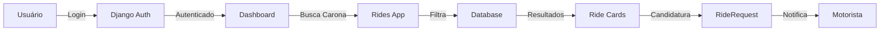

# BrazCar 🚗

> **Centralize suas caronas, conecte sua comunidade**

Plataforma web para centralizar e organizar caronas compartilhadas entre moradores de cidades rurais do DF e o centro de Brasília, eliminando a necessidade de múltiplos grupos de WhatsApp desorganizados.

[](https://www.djangoproject.com/)
[](https://www.python.org/)
[](LICENSE)
[](https://github.com)

---

## 📋 Índice

- [Sobre o Projeto](#-sobre-o-projeto)
- [O Problema](#-o-problema)
- [A Solução](#-a-solução)
- [Tecnologias](#️-tecnologias)
- [Arquitetura](#-arquitetura)
- [Funcionalidades](#-funcionalidades)
- [Instalação](#-instalação)
- [Como Usar](#-como-usar)
- [Estrutura do Projeto](#️-estrutura-do-projeto)
- [Roadmap](#-roadmap)
- [Contribuindo](#-contribuindo)
- [Licença](#-licença)

---

## 🎯 Sobre o Projeto

O **BrazCar** nasceu da necessidade real de moradores de cidades rurais do Distrito Federal que dependem de caronas compartilhadas para se locomover até o centro de Brasília. Atualmente, essas caronas são anunciadas em dezenas de grupos de WhatsApp, causando desorganização, redundância e perda de oportunidades.

### Contexto

Nas cidades rurais do DF:
- O transporte público é **precário** e com horários limitados
- O centro (Brasília) fica **longe** (30-50km em média)
- Moradores criaram **grupos de WhatsApp** para compartilhar caronas
- Com o tempo, surgiram **dezenas de grupos diferentes**
- Mesmas caronas são anunciadas **repetidamente** em vários grupos
- Informações se **perdem** em meio a conversas

---

## 📍 O Problema

### Anúncios Típicos em Grupos de WhatsApp

```
[07/10 15:39] +55 61 9142-9684:
03 VAGAS
Saindo às 19:30 ⏰

🚘 Esplanada
🚘 Eixo Monumental
🚘 Estrutural
🚘 Brazlândia

Chamar PV 📱
7,00 Dinheiro ou PIX
```

### Problemas Identificados

❌ **Redundância** - Mesmas caronas anunciadas em 5-10 grupos diferentes  
❌ **Desorganização** - Informações espalhadas, difíceis de encontrar  
❌ **Perda de Tempo** - Horas procurando caronas em grupos cheios de spam  
❌ **Falta de Filtros** - Não dá para buscar por rota ou horário específico  
❌ **Sem Histórico** - Mensagens antigas desaparecem  
❌ **Sem Avaliações** - Não há sistema de reputação de motoristas  

---

## 🎯 A Solução

O **BrazCar** é uma plataforma centralizada que:

### Benefícios para Passageiros
✅ **Busca Centralizada** - Todas as caronas em um só lugar  
✅ **Filtros Inteligentes** - Busca por origem, destino, horário, preço  
✅ **Candidatura Simplificada** - Um clique para solicitar vaga  
✅ **Avaliações** - Sistema de reputação de motoristas  
✅ **Notificações** - Alertas de novas caronas na sua rota  

### Benefícios para Motoristas
✅ **Anúncio Organizado** - Formulário padronizado para caronas  
✅ **Gerenciamento** - Controle de vagas e candidatos  
✅ **Visibilidade** - Alcance todos os interessados de uma vez  
✅ **Reputação** - Construa histórico positivo de viagens  
✅ **Sem Repetição** - Anuncie uma vez, alcance todos  

---

## 🛠️ Tecnologias

### Backend
- **Django 5.2+** - Framework web Python robusto e escalável
- **Python 3.12+** - Linguagem moderna com recursos avançados
- **SQLite** - Banco de dados para desenvolvimento
- **Pillow** - Processamento de imagens (fotos de perfil)

### Frontend
- **Tailwind CSS 4.1** - Framework CSS utilitário moderno
- **Vite 7.1** - Build tool ultra-rápido com HMR
- **JavaScript ES6** - Interatividade moderna no frontend
- **Django Templates** - Sistema de templates server-side

### Integrações
- **Django Vite** - Integração perfeita entre Django e Vite
- **django-vite 3.1+** - Hot Module Replacement em desenvolvimento

### Desenvolvimento
- **uv** - Gerenciador de pacotes Python moderno
- **npm** - Gerenciador de pacotes JavaScript
- **Git** - Controle de versão

---

## 🏗 Arquitetura

### Estrutura de Apps Django

O projeto segue uma arquitetura modular baseada em apps Django especializados:

```
BrazCar/
├── core/                    # ⚙️ Configurações Django
│   ├── settings.py          # Configurações principais
│   ├── urls.py              # Roteamento global
│   └── wsgi.py              # WSGI application
│
├── braz_car/               # 🎨 App principal (UI/Templates)
│   ├── templates/          # Templates base e componentes
│   │   ├── base.html       # Template base
│   │   ├── index.html      # Homepage
│   │   └── components/     # Componentes reutilizáveis
│   ├── context_processors.py
│   └── views.py
│
├── users/                  # 👤 Autenticação e Usuários
│   ├── models.py           # User (AbstractUser)
│   ├── views.py            # Login, Logout, Registro
│   ├── backends.py         # Autenticação multi-campo
│   └── urls.py             # Rotas de autenticação
│
├── rides/                  # 🚗 Sistema de Caronas
│   ├── models.py           # Ride, RideRequest
│   ├── views.py            # CRUD de caronas
│   └── urls.py             # Rotas de caronas
│
├── vehicles/               # 🚙 Cadastro de Veículos
│   ├── models.py           # Vehicle
│   └── admin.py            # Admin de veículos
│
├── locations/              # 📍 Localizações e Rotas
│   ├── models.py           # Location, Address
│   └── admin.py            # Admin de localizações
│
├── utils/                  # 🔧 Utilitários
│   └── validations/        # Validações (CPF, etc)
│
├── static/                 # 📦 Assets Estáticos
│   ├── css/                # Estilos (main.css)
│   └── js/                 # JavaScript (main.js)
│
└── assets/                 # 🎨 Assets do Vite
    └── (compilados)
```

### Fluxo de Dados



### Modelos de Dados

#### User (users.User)
```python
- username, email, password      # Autenticação
- cpf (unique)                   # Identificação única
- phone                          # Contato
- birth_date                     # Idade
- profile_picture                # Avatar
- is_verified                    # Verificação
- address → Location.Address     # Endereço
```

#### Ride (rides.Ride)
```python
- driver → User                  # Motorista
- vehicle → Vehicle              # Veículo usado
- location_start → Location      # Origem
- location_end → Location        # Destino
- created_at, updated_at         # Timestamps
```

#### RideRequest (rides.RideRequest)
```python
- ride → Ride                    # Carona solicitada
- user → User                    # Passageiro
- created_at, updated_at         # Timestamps
```

---

## ✨ Funcionalidades

### ✅ Implementadas

#### Sistema de Autenticação
- [x] **Login Multi-Campo**: Aceita username, email, CPF ou telefone
- [x] **Backend Customizado**: `MultiFieldBackend` para flexibilidade
- [x] **Proteção CSRF**: Segurança contra ataques
- [x] **Mensagens de Feedback**: Sucesso/erro para o usuário
- [x] **Logout Seguro**: Desconexão com redirecionamento
- [x] **Validação CPF**: Normalização e verificação de CPF

#### Interface do Usuário
- [x] **Menu Responsivo**: Desktop (dropdown) e Mobile (hamburger)
- [x] **Componentes Modulares**: 8 componentes reutilizáveis
- [x] **Design System**: Cores, tipografia e espaçamento padronizados
- [x] **Ride Cards**: Cards de carona completos e informativos
- [x] **Hot Reload**: Desenvolvimento ágil com Vite HMR
- [x] **Templates Organizados**: Estrutura modular do Django

#### Arquitetura
- [x] **Apps Especializados**: 5 apps Django bem definidos
- [x] **Models Estruturadas**: Relacionamentos claros
- [x] **URLs Namespaced**: Organização clara de rotas
- [x] **Context Processors**: Dados mockados para desenvolvimento
- [x] **Settings Configurados**: Ambiente otimizado

### 🚧 Em Desenvolvimento

- [ ] **Cadastro de Usuários**: Formulário completo com validação
- [ ] **CRUD de Caronas**: Criar, editar, excluir anúncios
- [ ] **Sistema de Busca**: Filtros por origem, destino, horário
- [ ] **Candidaturas**: Solicitação e gerenciamento de vagas
- [ ] **Avaliações**: Sistema de rating entre usuários

### 🔮 Planejadas

- [ ] **Chat Integrado**: Mensagens entre motorista e passageiro
- [ ] **Notificações Push**: Alertas de novas caronas
- [ ] **Pagamentos**: Integração com PIX
- [ ] **App Mobile**: React Native para iOS/Android
- [ ] **Analytics**: Dashboard para motoristas
- [ ] **Rotas Fixas**: Caronas recorrentes

---

## 🚀 Instalação

### Pré-requisitos

- **Python 3.12+** instalado
- **Node.js 18+** e npm instalados
- **Git** para clonar o repositório
- **(Opcional) uv** para gerenciamento de pacotes Python

### Passo a Passo

#### 1. Clone o Repositório
```bash
git clone https://github.com/seu-usuario/BrazCar.git
cd BrazCar
```

#### 2. Configure o Ambiente Python
```bash
# Usando venv (tradicional)
python -m venv .venv
source .venv/bin/activate  # Linux/Mac
# ou
.venv\Scripts\activate  # Windows

# Instalar dependências
pip install -r requirements.txt

# OU usando uv (recomendado)
uv venv
source .venv/bin/activate
uv pip install -e .
```

#### 3. Configure o Banco de Dados
```bash
# Aplicar migrações
python manage.py migrate

# Criar superusuário para acessar o admin
python manage.py createsuperuser
# Siga as instruções e forneça:
# - Username
# - Email
# - CPF (11 dígitos)
# - Phone
# - Birth date
# - Password
```

#### 4. Configure o Frontend
```bash
# Instalar dependências do Node
npm install

# Verificar se Tailwind e Vite foram instalados
npm list vite tailwindcss
```

#### 5. Inicie os Servidores

**Terminal 1: Django**
```bash
python manage.py runserver
```

**Terminal 2: Vite**
```bash
npm run dev
```

#### 6. Acesse a Aplicação
- **Frontend**: <http://localhost:8000>
- **Admin Django**: <http://localhost:8000/admin>
- **Vite Dev Server**: <http://localhost:5173>

---

## 💡 Como Usar

### Testando o Login

1. **Acesse a página de login**
   - Clique em "Entrar" no menu
   - Ou vá direto para: <http://localhost:8000/users/login/>

2. **Faça login com qualquer campo**
   - **Username**: Nome de usuário criado
   - **Email**: seu@email.com
   - **CPF**: 12345678900 (com ou sem pontos/traços)
   - **Telefone**: 61912345678

3. **Funcionalidades do Login**
   - ✅ Validação de campos obrigatórios
   - ✅ Mensagens de erro amigáveis
   - ✅ Redirecionamento inteligente
   - ✅ Design responsivo

### Explorando o Site

- **Homepage**: Veja exemplos de cards de carona
- **Menu**: Navegue pelas seções (em desenvolvimento)
- **Admin**: Gerencie dados via Django Admin

---

## 🗂️ Estrutura do Projeto

### Componentes Reutilizáveis

Localização: `braz_car/templates/components/`

| Componente | Descrição |
|-----------|-----------|
| `header.html` | Cabeçalho principal com menu completo |
| `logo.html` | Logo do BrazCar (duas bolhas) |
| `nav_items.html` | Links de navegação com estado ativo |
| `user_menu.html` | Menu dropdown do usuário (login/logout) |
| `mobile_menu.html` | Menu hamburger para mobile |
| `ride_card.html` | Card de carona reutilizável e completo |
| `search_bar.html` | Barra de pesquisa com ícone |
| `offer_ride_button.html` | Botão "Oferecer carona" |

### Sistema de Design

**Cores Principais**
- **Primary**: Azul (#3b82f6)
- **Secondary**: Teal (#0d9488)
- **Success**: Verde (#10b981)
- **Error**: Vermelho (#ef4444)
- **Gray Scale**: De gray-50 a gray-900

**Tipografia**
- **Fonte**: Inter (sans-serif)
- **Tamanhos**: Sistema modular do Tailwind

**Componentes Estilizados**
- Botões: `.btn-primary`, `.btn-secondary`
- Inputs: `.form-input`, `.form-label`
- Cards: `.card`, `.card-hover`
- Links: `.nav-link`, `.nav-link.active`

---

## 📊 Roadmap

### v0.2.0 - Alpha (Atual) ✅
- [x] Sistema de autenticação multi-campo
- [x] Interface responsiva e componentes
- [x] Estrutura de banco de dados
- [x] Ambiente de desenvolvimento

### v0.3.0 - Cadastro (Próximo)
- [ ] Formulário de cadastro de usuários
- [ ] Upload de foto de perfil
- [ ] Validação de CPF em tempo real
- [ ] Confirmação de email/telefone

### v0.4.0 - Caronas
- [ ] CRUD completo de caronas
- [ ] Sistema de pontos de parada
- [ ] Validação de horários e datas
- [ ] Formulário intuitivo

### v0.5.0 - Busca e Filtros
- [ ] Sistema de busca avançada
- [ ] Filtros por rota, horário, preço
- [ ] Ordenação de resultados
- [ ] Paginação

### v0.6.0 - Candidaturas
- [ ] Sistema de solicitação de vagas
- [ ] Gerenciamento de candidatos
- [ ] Status de candidatura
- [ ] Notificações básicas

### v0.7.0 - Avaliações
- [ ] Sistema de rating (1-5 estrelas)
- [ ] Comentários sobre viagens
- [ ] Perfil público com histórico
- [ ] Badges de conquistas

### v1.0.0 - MVP
- [ ] Chat integrado
- [ ] Notificações push
- [ ] Testes automatizados
- [ ] Deploy em produção
- [ ] Documentação completa

---

## 🤝 Contribuindo

Contribuições são muito bem-vindas! Este é um projeto open-source com impacto social real.

### Como Contribuir

1. **Fork** o projeto
2. **Clone** seu fork: `git clone https://github.com/seu-usuario/BrazCar.git`
3. **Crie uma branch**: `git checkout -b feature/nova-funcionalidade`
4. **Commit** suas mudanças: `git commit -m 'Add: nova funcionalidade'`
5. **Push** para a branch: `git push origin feature/nova-funcionalidade`
6. **Abra um Pull Request**

### Diretrizes

- Siga o padrão de código existente
- Escreva testes para novas funcionalidades
- Atualize a documentação quando necessário
- Mensagens de commit claras e descritivas
- Um commit por funcionalidade/correção

### Áreas que Precisam de Ajuda

- 🎨 **Design/UX**: Melhorias na interface
- 💻 **Backend**: Novas funcionalidades
- 🧪 **Testes**: Cobertura de testes
- 📱 **Mobile**: App React Native
- 📝 **Documentação**: Tutoriais e guias

---

## 📄 Licença

Este projeto está sob a licença MIT. Veja o arquivo [LICENSE](LICENSE) para mais detalhes.

---

## 📞 Contato e Suporte

- **Issues**: [GitHub Issues](https://github.com/seu-usuario/BrazCar/issues)
- **Discussões**: [GitHub Discussions](https://github.com/seu-usuario/BrazCar/discussions)
- **Email**: contato@brazcar.com.br

---

## 🙏 Agradecimentos

Agradecimentos especiais aos moradores das cidades rurais do DF que compartilharam suas experiências e necessidades, tornando este projeto possível.

---

<div align="center">

**BrazCar** - Conectando comunidades através da economia colaborativa 🚗💚

Feito com ❤️ para quem precisa se locomover com dignidade e segurança

[⬆ Voltar ao topo](#brazcar-)

</div>
